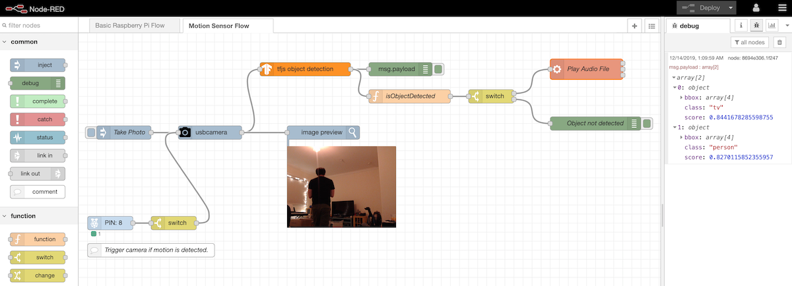
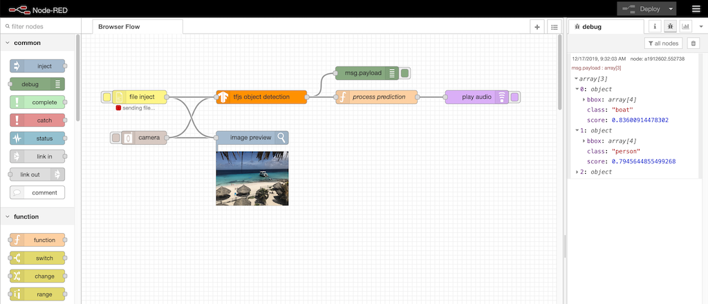

[](https://travis-ci.org/IBM/node-red-tensorflowjs)

# Developing a Machine Learning IoT App with Node-RED and TensorFlow.js

In most cases, enabling your IoT device with AI capabilities involves sending the data from the device to a server. The machine learning calculations would happen on the server. Then the results sent back to the device for appropriate action.

When data security or network connectivity is a concern this is not an ideal or feasible approach.

With this code pattern, you will learn how to build and deploy machine learning apps that can run offline and directly on the device (in this case a Raspberry Pi). Using Node-RED with TensorFlow.js you can incorporate machine learning into your device is an easy, low-code way.

[Node-RED](https://nodered.org) is an open source visual programming tool that offers a browser-based flow editor for wiring together devices, APIs, and services. Built on Node.js, you can extend its features by creating your own nodes or taking advantage of the JavaScript and NPM ecosystem.

[TensorFlow.js](https://js.tensorflow.org) is an open source JavaScript library to build, train, and run machine learning models in JavaScript environments such as the browser and Node.js.

Combining Node-RED with TensorFlow.js  developers and IoT enthusiasts can more easily add machine learning functionality onto their devices.

When you have completed this code pattern, you will understand how to:

* Create a Node-RED node that includes a TensorFlow.js model
* Build and deploy a Node-RED application that uses a TensorFlow.js node


## Flow

1. The user owns or downloads a machine learning model in TensorFlow.js format.
1. The user creates a Node-RED node for the TensorFlow.js model and wires the TensorFlow.js node in a Node-RED application.
1. The user can deploy the Node-RED application locally.
1. The uses access the Node-RED application from a browser and triggers inferencing on images captured from a webcam.
1. Alternatively, the user can deploy the Node-RED application to a Raspberry Pi.
1. The device runs the Node-RED application and performs inferencing on images from a camera.
1. The device can output to a connected speaker or take some other action depending on the inference results.


## Included Components

- [Node-RED](https://nodered.org): A flow-based programming tool for wiring together hardware devices, APIs, and online services
- [TensorFlow.js](https://js.tensorflow.org): A JavaScript library for training and deploying ML models in the browser and on Node.js


## Featured Technologies

- Machine Learning
- IoT
- JavaScript / Node.js


## Watch the Video

[](https://www.youtube.com/watch?v=6sFrQaDtK5Q)

## Prerequisites

- [git](https://git-scm.com/downloads) installed and configured
- [Node.js](https://nodejs.org/en/) installation (with NPM)
- [Python 2.7](https://www.python.org/download/releases/2.7/) environment
- Familiarity with basic [Node-RED](https://nodered.org/docs/) concepts

## Steps

Follow these steps to setup and run this code pattern. The steps are described in detail below.

1. [Clone the repo](#clone-the-repo)
1. [Install Node-RED](#install-node-red)
1. [Install the TensorFlow.js node](#install-the-tensorflowjs-node)
1. [Import the Node-RED flow](#import-the-node-red-flow)
1. [Deploy the Node-RED flow](#deploy-the-node-red-flow)

### Clone the repo

First let's get the code. From the terminal of the system you plan on running Node-RED from,
do the following:

1. Clone the `node-red-tensorflowjs` repo
    ```
    $ git clone https://github.com/IBM/node-red-tensorflowjs
    ```

1. Take note of the directory of the cloned repo (e.g., `/Users/myuser/node-red-tensorflowjs`)
    ```
    $ cd node-red-tensorflowjs
    $ pwd
    ```

**Note**: For Raspberry Pi users, details on accessing the command line can be found in the
[remote access documentation](https://www.raspberrypi.org/documentation/remote-access/) if not
connecting with a screen and keyboard.

### Install Node-RED

If you don't already have Node-RED installed and plan to run it locally,
please install it using instructions found [here](https://nodered.org/docs/getting-started/local).

If you are using a Raspberry Pi, instructions for Node-RED can be found [here](https://nodered.org/docs/getting-started/raspberrypi).
However, if you are using the Raspbian operating system for the Raspberry Pi, Node-RED comes pre-installed.

#### Start Node-RED

Node-RED can be started from a terminal by running:
```
$ node-red
```

#### Stop Node-RED

You can stop Node-RED by closing the terminal window or using `Ctrl-C` in the terminal.

#### Node-RED editor

The Node-RED editor can be accessed from `http://localhost:1880`.

However, if Node-RED is on the Raspberry Pi, you can connect to it via `http://<Raspberry Pi IP>:1880`.

### Install the TensorFlow.js node

Before running and using a TensorFlow.js model in a Node-RED application, a TensorFlow.js node will need to be created and installed to your Node-RED environment. From a terminal run:

1. Go into your Node-RED user directory (e.g., `~/.node-red`)
    ```
    $ cd ~/.node-red
    ```

1. Install the `node-red-contrib-tfjs-object-detection` node found in this repo (using the full directory path noted when the repo was cloned)
    ```
    $ npm install <full path>/node-red-contrib-tfjs-object-detection
    ```

    > **NOTE**: _Currently, the installation of the `@tensorflow/tfjs-node` dependency [requires Python 2.7](https://github.com/tensorflow/tfjs/tree/master/tfjs-node#windows--mac-os-x-requires-python-27). Bindings will not properly install with Python 3.x._
    >

If it is running, you will then need to stop and restart Node-RED for the newly installed nodes to be recognized.

### Import the Node-RED flow

Once installed the node can be added and used in the flow of your Node-RED application. To import the flows available in this repo:

1. Make sure Node-RED is running
1. Open a browser and go to your Node-RED Editor
1. Click on the Node-RED Menu
1. Click on **Import**
1. Select the **Clipboard** tab
1. Click on **select a file to import**
1. Browse to and select one of the flow files in the cloned repo
    - If trying things out locally on your browser, then use the `browser-flow.json`.
    - If using a Raspberry Pi with peripherals, then use the `raspberrypi-flows.json`.
1. Select **Import to new flow**
1. Click **Import**

### Deploy the Node-RED flow

The Node-RED flow can be deployed in multiple ways. Follow the options that best fits your use case:

- [Running on a Raspberry Pi](#running-on-a-raspberry-pi)
- [Running on a laptop or workstation](#running-on-a-laptop-or-workstation)

#### Running on a Raspberry Pi

The Raspberry Pi flows use hardware peripherals and Raspberry Pi specific nodes. This assumes you imported
the `raspberrypi-flows.json` file.

##### Pre-requisites

The following hardware components are needed to fully run this flow:

- Raspberry Pi (tested with version 4, but older versions should work)
- Camera peripheral (Pi camera module or USB camera)
- Speaker peripheral (USB or 3.5mm jack speaker)
- [Optional] GPIO motion sensor (e.g. HC-SR501 PIR Motion Sensor)

Additionally, a few custom nodes are needed and can be added through the
[Palette Manager](https://nodered.org/docs/user-guide/runtime/adding-nodes):

- [`node-red-contrib-image-output`](https://flows.nodered.org/node/node-red-contrib-image-output)
- [`node-red-contrib-camerapi`](https://flows.nodered.org/node/node-red-contrib-camerapi) if using a Raspberry Pi
  [Camera Module](https://www.raspberrypi.org/products/camera-module-v2/)
- [`node-red-contrib-usbcamera`](https://flows.nodered.org/node/node-red-contrib-usbcamera) if using a USB camera.
    - If using this node, you must also install `fswebcam` on the Raspberry Pi by running `sudo apt install fswebcam`.


##### Deploy and run on a Raspberry Pi

The imported flows file contains two flows:

  - Basic Raspberry Pi Flow
    - A flow where a user can manually trigger the camera attached to the Pi (in our case, a USB camera) to take
      a snapshot. The snapshot is sent to the `tfjs object detection` node where objects will be detected.
      A function node will use simple JavaScript to check if any of the detected classes is a class of interest
      (in this case,  a `person`). If so, a `.wav` audio file located on the Pi is played through the connected speaker.
  - Motion Sensor Flow
    - Same as the basic flow above, but with a node to handle input from the GPIO motion sensor. If the sensor
      detects motion, the output will be 1, and this will trigger the camera to take a snapshot and execute the
      rest of the flow.

Make sure all your hardware is connected, then:

1. Double click on `Play Audio File` exec node and change the path in the append section to the path of
   a `.wav` file of your choosing. Click `Done` when finished.
1. Click the **Deploy** button.
1. Trigger the camera.  
    a. Can manually trigger the snapshot by clicking the `Take Photo` inject node.  
    b. If using the motion sensor flow, motion near the sensor will trigger the camera.

**Note**: Feel free to change the detected object by editing the code in the `isObjectDetected` node.

#### Running on a laptop or workstation

##### Pre-requisites

The browser flow uses custom nodes which need to be [added to the Palette Manager](https://nodered.org/docs/user-guide/runtime/adding-nodes):

- [`node-red-contrib-browser-utils`](https://flows.nodered.org/node/node-red-contrib-browser-utils)
- [`node-red-contrib-play-audio`](https://flows.nodered.org/node/node-red-contrib-play-audio)
- [`node-red-contrib-image-output`](https://flows.nodered.org/node/node-red-contrib-image-output)

##### Deploy and run locally

From the Node-RED editor, do the following:

1. Click the **Deploy** button.
1. Upload or capture an image.  
    a. Click the `file inject` node and browse to an image.  
    b. Click the `camera` node and allow the browser to access the webcam.

The image will be processed by the `tfjs object detection` node and the output will be displayed in the **Debug** panel. If the browser supports the Web Audio API the objects detected will be spoken.


## Output

#### Raspberry Pi flow



#### Browser flow




## Links

- [Node-RED](https://nodered.org)
- [TensorFlow.js](https://js.tensorflow.org)
- Bring Machine Learning to the Browser With TensorFlow.js - [Part I](https://medium.com/ibm-watson-data-lab/bring-machine-learning-to-the-browser-with-tensorflow-js-part-i-16924457291c), [Part II](https://medium.com/ibm-watson-data-lab/bring-machine-learning-to-the-browser-with-tensorflow-js-part-ii-7555ed9a999e), [Part III](https://medium.com/ibm-watson-data-lab/bring-machine-learning-to-the-browser-with-tensorflow-js-part-iii-62d2b09b10a3)
- [Optimize your visual recognition classification](https://developer.ibm.com/components/node-red/patterns/optimize-visual-recognition-classification)
- [TensorFlow.js and Node-RED: The Low-Code Approach to ML Apps for IoT](https://ibm.biz/tfjs-nodered)
- [Creating Custom Node-RED Nodes for your API: The Easy Way](https://medium.com/codait/creating-custom-node-red-nodes-for-your-api-the-easy-way-10770ccd8923)
- [Node-RED Nodes for Machine Learning with TensorFlow.js](https://github.com/vabarbosa/tfjs-node-red)
- [Node-RED modules for TensorFlow.js](https://github.com/tonanhngo/nodered-tfjs)
- [Node-Red custom node for DeepSpeech2](https://github.com/yhwang/node-red-contrib-ds2-tfjs)
- [Pretrained models for TensorFlow.js](https://github.com/tensorflow/tfjs-models)


## License

This code pattern is licensed under the Apache License, Version 2. Separate third-party code objects invoked within this code pattern are licensed by their respective providers pursuant to their own separate licenses. Contributions are subject to the [Developer Certificate of Origin, Version 1.1](https://developercertificate.org/) and the [Apache License, Version 2](https://www.apache.org/licenses/LICENSE-2.0.txt).

[Apache License FAQ](https://www.apache.org/foundation/license-faq.html#WhatDoesItMEAN)
